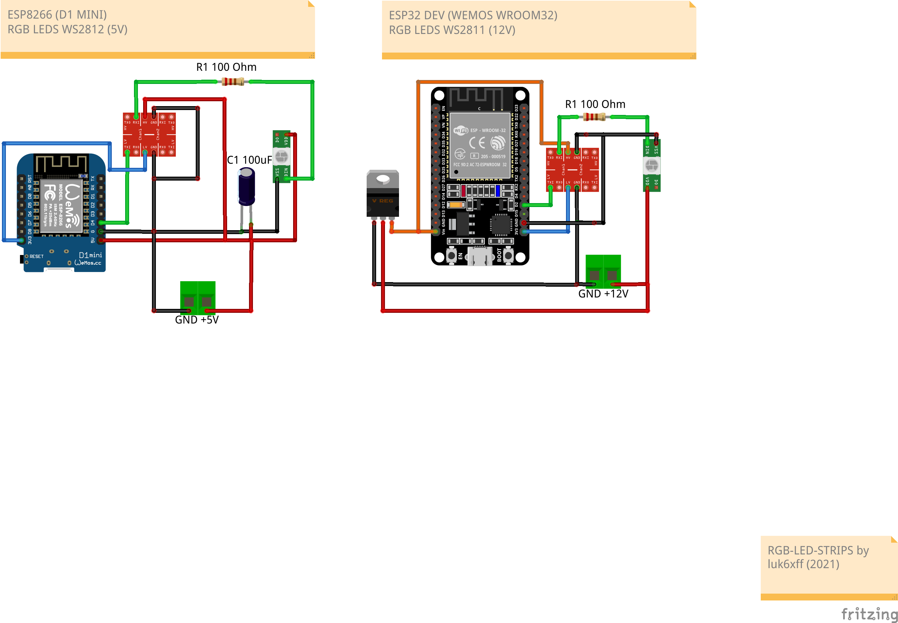

# RGB LED STRIPS project by luk6xff
Project of RGB LED driver based on the excellent [WLED library](https://github.com/Aircoookie/WLED).

## Connections
Connect a WS2812B-compatible RGB(W) led strip to `GPIO2`. On most ESP8266 based development boards this pin is labeled `D4` (Note: On a NodeMCU ESP8266 Board a 4.7kOhm pullup to 3.3V might be needed, since the pin may not be pulled down to GND by the LED strip during the bootphase of the board), on ESP32 based boards use `D2` or `G2` or `2`. If this wire cannot be kept short, use a level shifter/translator. Optionally connect a normally open pushbutton to GPIO0 (NodeMCU/Wemos pin D3) and ground.
Note: Board pin naming varies depending on the manufacturer. Please use the board pinout from the specific board you purchased and use the GPIO PINS to reference this guide. Make sure to connect ESP and LED-strip grounds together.

### Connections schematics:



## PIO tool path
If `pio` tool is not visible globally, set the alias:
```sh
alias pio=~/.platformio/penv/bin/pio
```

## Build and Flashing
* ESP32_DEV
1. Choose: `env:esp32dev`, run `Build` and when finished `Upload` button.
2. Or run the following command:
```sh
pio run --environment esp32dev && pio run --target upload  --environment esp32dev --upload-port /dev/ttyACM0
```

* ESP8266 WEMOS D1_MINI
1. Choose: `env:d1_mini`, run `Build` and when finished `Upload` button.
2. Or run the following command:
```sh
pio run --environment d1_mini && pio run --target upload  --environment d1_mini
```
